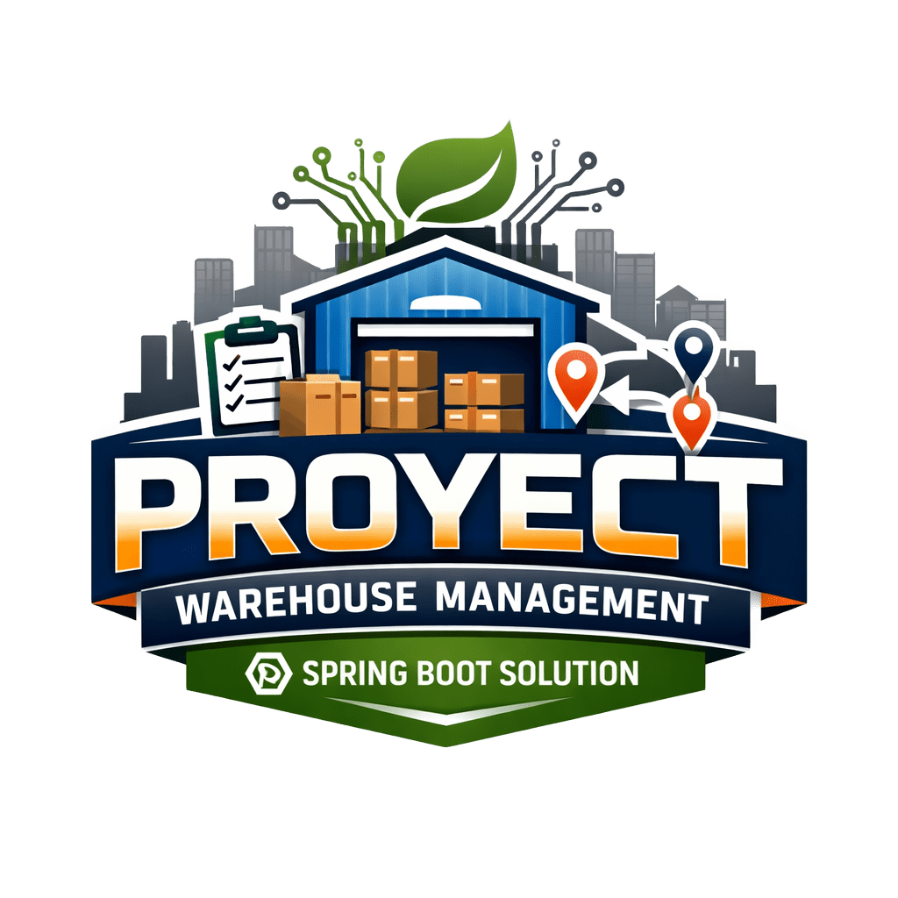

<div align="center">
    
</div>

## Project Warehouse Management Spring Boot

La empresa LogiTrack S.A. administra varias bodegas distribuidas en distintas ciudades, encargadas de almacenar productos y gestionar movimientos de inventario (entradas, salidas y transferencias).

Hasta ahora, el control de inventarios y auditorias se hacia manualmente en hojas de calculo, sin trazabilidad ni control de accesos.

La direccion general busca implementar un sistema backend centralizado en Spring Boot, que permita:

- Controlar todos los movimientos entre bodegas.
- Registrar automaticamente los cambios (auditorias).
- Proteger la informacion con autenticacion JWT.
- Ofrecer endpoints REST documentados y seguros.

## Objetivo General

Desarrollar un sistema de gestion y auditoria de bodegas que permita registrar transacciones de inventario y generar reportes auditables de los cambios realizados por cada usuario.

## Requisitos Funcionales

### Gestion de Bodegas

- Registrar, consultar, actualizar y eliminar bodegas.
- Campos: `id`, `nombre`, `ubicacion`, `capacidad`, `encargado`.

### Gestion de Productos

- CRUD completo de productos.
- Campos: `id`, `nombre`, `categoria`, `stock`, `precio`.

### Movimientos de Inventario

- Registrar entradas, salidas y transferencias entre bodegas.
- Cada movimiento debe almacenar: fecha, tipo de movimiento (`ENTRADA`, `SALIDA`, `TRANSFERENCIA`), usuario responsable (empleado logueado), bodega origen/destino, productos y cantidades.

### Auditoria de Cambios

- Crear una entidad `Auditoria` para registrar: tipo de operacion (`INSERT`, `UPDATE`, `DELETE`), fecha y hora, usuario que realizo la accion, entidad afectada y valores anteriores/nuevos.
- Implementar auditoria automatica mediante listeners de JPA (`EntityListeners`) o un aspecto con anotaciones personalizadas (opcional).

### Autenticacion y Seguridad

- Implementar seguridad con Spring Security + JWT.
- Endpoints `/auth/login` y `/auth/register`.
- Rutas seguras para `/bodegas`, `/productos`, `/movimientos`.
- Rol de usuario (`ADMIN` / `EMPLEADO`).

### Consultas Avanzadas y Reportes

- Endpoints con filtros para productos con stock bajo (`< 10` unidades), movimientos por rango de fechas (`BETWEEN`) y auditorias por usuario o por tipo de operacion.
- Reporte REST de resumen general (JSON): stock total por bodega y productos mas movidos.

### Documentacion

- Documentar toda la API con Swagger/OpenAPI 3.
- Probar los endpoints protegidos (token JWT incluido).

### Excepciones y Validaciones

- Manejo global de errores con `@ControllerAdvice`.
- Validaciones con anotaciones `@NotNull`, `@Size`, `@Min`, etc.
- Respuestas JSON personalizadas para errores (`400`, `401`, `404`, `500`).

## Despliegue

- Configurar base de datos MySQL en `application.properties`.
- Incluir scripts SQL (`schema.sql`, `data.sql`).
- Ejecutar con Tomcat embebido o externo.
- Frontend basico en HTML/CSS/JS para probar el login y las consultas principales.

## Estructura Sugerida del Proyecto

```text
src/
 ├─ controller/
 ├─ service/
 ├─ repository/
 ├─ model/
 ├─ config/
 ├─ security/
 └─ exception/
```

## Resultado Esperado

### Entregables

- Codigo fuente completo del backend en Spring Boot.
- Scripts SQL (`schema.sql` y `data.sql`).
- Documentacion Swagger.
- README con descripcion del proyecto, instrucciones de instalacion y ejecucion, ejemplos de endpoints, y capturas de Swagger y pruebas.
- Carpeta `frontend/` con HTML/CSS/JS que consuma los endpoints.
- Documento explicativo (PDF o Markdown) con diagrama de clases, descripcion de arquitectura, y ejemplo de token JWT y uso.
- Repositorio en GitHub.

<br>
<br>

---

# LogiTrack Warehouse Management

Aplicacion monolitica construida con Spring Boot para administrar productos, bodegas, movimientos de inventario, autenticacion JWT y una consola web estatica para operacion interna.

## Estado Actual

- Backend REST con Spring Boot, Spring Security y Spring Data JPA.
- Base de datos MySQL con esquema `logiTrack`.
- Autenticacion JWT para proteger la API.
- Administracion de usuarios con rol `ADMIN`.
- Frontend estatico en HTML, CSS y JavaScript modular.
- Integracion de notificaciones por email a traves de una API externa en FastAPI.
- Documentacion interactiva con Swagger/OpenAPI.

## Modulos Implementados

- `Auth`
  Registro, login, perfil del usuario autenticado y cambio de contrasena.
- `Users`
  Consulta de usuarios y creacion de nuevos usuarios desde administracion.
- `Products`
  CRUD de productos y consulta de stock bajo.
- `Warehouses`
  CRUD de bodegas y asignacion de manager.
- `Movements`
  CRUD de movimientos con reglas para `ENTRY`, `EXIT` y `TRANSFER`.
- `Notifications`
  Envio de emails al registrarse y al iniciar sesion usando provider + factory.

## Seguridad

- `POST /api/auth/register` y `POST /api/auth/login` son publicos.
- Swagger UI y los assets del frontend estatico son publicos.
- `GET /api/auth/me`, `PATCH /api/auth/change-password`, productos, bodegas y movimientos requieren Bearer token.
- `/api/users/**` requiere rol `ADMIN`.

## Frontend

La aplicacion estatica vive en `src/main/resources/static` y se organiza asi:

- `index.html`
  Login.
- `register.html`
  Registro.
- `platform/system.html`
  Dashboard operativo.
- `platform/products.html`
  Gestion de productos.
- `platform/profile.html`
  Perfil y cambio de contrasena.
- `platform/admin.html`
  Consola administrativa para usuarios y asignacion de managers.
- `js/core`
  Sesion, helpers UI y acceso a API.
- `js/pages`
  Logica por pantalla.
- `styles`
  Estilos base, auth y app.

## Configuracion

Las propiedades principales estan en [application.properties](/home/alexi-dg/Desktop/GitHub_Repositories/SpringBoot/warehouse-management/src/main/resources/application.properties):

- `server.port`
- `spring.datasource.*`
- `app.security.jwt.secret`
- `app.notifications.email.enabled`
- `app.notifications.email.provider`
- `app.notifications.email.fastapi.base-url`
- `app.notifications.email.fastapi.send-path`

## Ejecucion Local

1. Crear la base de datos MySQL `logiTrack`.
2. Ajustar credenciales y propiedades en `application.properties`.
3. Ejecutar la aplicacion Spring Boot.

```bash
./mvnw spring-boot:run
```

La app quedara disponible en:

- API: `http://localhost:8000`
- Swagger UI: `http://localhost:8000/swagger-ui.html`
- Frontend: `http://localhost:8000/`

## Documentacion del Repositorio

- [docs/architecture.md](/docs/architecture.md)
- [docs/api-overview.md](/docs/api-overview.md)
- [docs/api_docs.md](/docs/api_docs.md)
- [docs/products-api.md](/home/alexi-dg/Desktop/GitHub_Repositories/SpringBoot/warehouse-management/docs/products-api.md)
- [docs/auth-users-api.md](/docs/auth-users-api.md)
- [docs/frontend-overview.md](/docs/frontend-overview.md)
- [docs/notifications-context.md](/docs/notifications-context.md)

## Limitaciones Actuales

- No existe aun un modulo funcional de auditoria automatica conectado a `audit_change`.
- No hay pruebas end-to-end del frontend.
- El stock bajo se calcula desde movimientos, no desde una tabla dedicada de inventario consolidado.

<br>
<br>
<br>


# Examen - Ultimos movimientos

La empresa **LogiTrack S.A.** desea que el sistema permita a los supervisores revisar rápidamente los últimos movimientos registrados en las bodegas.

Tu tarea consiste en implementar **una consulta REST y un pequeño reporte resumido** que faciliten la visualización de esta información.

## Instrucciones

1. **Endpoint de movimientos recientes:**
  - En MovimientoController, crea un endpoint:
  @GetMapping("/movimientos/recientes")
  public ResponseEntity<List<MovimientoDTO>> listarRecientes()
  Este endpoint debe retornar los últimos 10 movimientos registrados, ordenados por fecha descendente.

2. **Endpoint de reporte básico:**
  - En ReporteController, crea un endpoint /reportes/movimientos que retorne un JSON con:
    - Cantidad total de movimientos registrados.
    - Número de movimientos por tipo (ENTRADA, SALIDA, TRANSFERENCIA).

3. **Probar los endpoints en Postman mostrando:**
- Petición GET a /movimientos/recientes con resultado JSON.
- Petición GET a /reportes/movimientos con el resumen.


## Resultado esperado

Entregables:

  - Código fuente actualizado con los endpoints requeridos.
  - Capturas de Postman mostrando las respuestas de ambos endpoints.
  - Captura del Swagger donde aparezcan documentados.