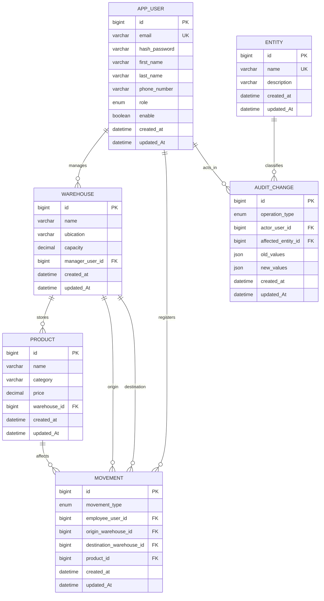

<div align="center">
    
    <h1>LogiTrack Database</h1>
    <p>MySql System - InnoDB</p>
    <h2>Alexi Durán Gómez</h2>
    <p>Bucaramanga, Santander</p>
    <p>Miércoles 11 - Marzo - 2026</p>
</div>


## Índice

1. [Introducción](#introducción)
2. [Caso de estudio](#caso-de-estudio)
   - [Objetivo del sistema](#objetivo-del-sistema)
   - [Tecnología utilizada](#tecnología-utilizada)
3. [Planificación](#planificación)
   - [Construcción del modelo Entidad Relación](#construcción-del-modelo-entidad-relación)
   - [Descripción de entidades](#descripción-de-entidades)
   - [Modelo Entidad Relación](#modelo-entidad-relación)
4. [Normalización](#normalización)
   - [Primera forma normal (1FN)](#primera-forma-normal-1fn)
   - [Segunda forma normal (2FN)](#segunda-forma-normal-2fn)
   - [Tercera forma normal (3FN)](#tercera-forma-normal-3fn)
5. [Mejoras futuras](#mejoras-futuras)

## Introducción

La base de datos de **LogiTrack** fue diseñada para soportar la operación principal del sistema de gestión de bodegas, productos, movimientos de activos individuales y auditoría de cambios. Su propósito es centralizar la información operativa de la empresa y asegurar que cada transacción relevante quede registrada con reglas claras de integridad.

El esquema actual está orientado a un entorno **MySQL 8 con motor InnoDB**, lo que permite trabajar con claves foráneas, restricciones `CHECK`, índices y transacciones. El modelo separa las entidades principales del negocio y trata cada producto como un activo individual con una sola ubicación actual.

Dentro de la carpeta `database/` se incluyen dos archivos principales:

- `logitrack-database.sql`: crea la base de datos, define el esquema e inserta datos de prueba.
- `logitrack-queries.sql`: contiene consultas de ejemplo para explotar la información almacenada.

Para ejecutar el script base en MySQL:

```sql
SOURCE database/logitrack-database.sql;
```

Y para probar las consultas de reporte:

```sql
SOURCE database/logitrack-queries.sql;
```

## Caso de estudio

LogiTrack S.A. administra varias bodegas distribuidas en distintas ciudades. En esas bodegas se almacenan productos que entran desde proveedores externos, salen por despacho o consumo interno, y también se transfieren entre sedes según la necesidad operativa.

Antes del sistema, el seguimiento de productos y cambios administrativos se realizaba manualmente en hojas de cálculo. Ese enfoque dificultaba la trazabilidad, generaba inconsistencias y no permitía saber con precisión quién había ejecutado una acción o cuándo ocurrió.

La base de datos propuesta resuelve ese problema creando una estructura relacional que:

- organiza usuarios, bodegas y productos,
- registra entradas, salidas y transferencias,
- conserva una bitácora de auditoría,
- y habilita consultas para reportes y control operativo.

### Objetivo del sistema

Diseñar una base de datos relacional que permita administrar la operación logística de la empresa, garantizando consistencia de datos, trazabilidad de movimientos y soporte para auditoría.

Objetivos específicos:

- registrar usuarios con roles básicos (`ADMIN` y `USER`);
- asociar bodegas con un encargado responsable;
- almacenar productos con su ubicación actual;
- registrar movimientos de activos con origen, destino y responsable;
- dejar evidencia de inserciones, actualizaciones y eliminaciones mediante auditoría;
- facilitar consultas de ubicación actual, historial y actividad de usuarios.

### Tecnología utilizada

La solución fue implementada con las siguientes decisiones técnicas:

- **Motor de base de datos:** MySQL 8.
- **Motor de almacenamiento:** InnoDB.
- **Codificación:** `utf8mb4` con colación `utf8mb4_unicode_ci`.
- **Lenguaje de definición y manipulación:** SQL.
- **Tipos especiales utilizados:** `ENUM`, `JSON`, `DATETIME`, `DECIMAL`.
- **Mecanismos de integridad:** claves primarias, claves foráneas, índices, restricciones `CHECK`, `UNIQUE` y reglas `ON DELETE` / `ON UPDATE`.

Estas decisiones permiten que el esquema sirva tanto para persistencia transaccional como para consultas analíticas básicas sin perder consistencia relacional.

## Planificación

### Construcción del modelo Entidad Relación

El modelo se construyó a partir de los requisitos operativos del sistema. Primero se identificaron los objetos del dominio que debían persistirse:

- usuarios del sistema,
- bodegas,
- productos,
- movimientos de inventario,
- tipos de entidad auditables,
- registros de auditoría.

Luego se definieron sus relaciones:

- un usuario puede gestionar ninguna, una o varias bodegas;
- una bodega puede contener múltiples productos;
- un producto puede participar en múltiples movimientos;
- un usuario puede registrar múltiples movimientos;
- una entidad auditable puede aparecer en múltiples registros de auditoría;
- un usuario puede ser actor de múltiples eventos auditados.

La tabla `movement` funciona como una entidad transaccional. Modela cada cambio de ubicación de un activo individual y por eso contiene referencias al usuario responsable, al producto afectado y a la bodega origen o destino según el tipo de movimiento.

Además, se incorporaron reglas de negocio directamente en la base:

- una entrada debe tener solo bodega destino;
- una salida debe tener solo bodega origen;
- una transferencia debe tener bodega origen y destino diferentes;
- el precio del producto y la capacidad de la bodega no pueden ser negativos.

### Descripción de entidades

#### 1. `app_user`

Almacena los usuarios del sistema que pueden autenticarse o ser responsables de operaciones.

| Campo | Tipo | Descripción |
| --- | --- | --- |
| `id` | `BIGINT UNSIGNED` | Identificador único del usuario. |
| `email` | `VARCHAR(100)` | Correo del usuario. Es único. |
| `hash_password` | `VARCHAR(255)` | Contraseña cifrada. |
| `first_name` | `VARCHAR(100)` | Nombre del usuario. |
| `last_name` | `VARCHAR(100)` | Apellido del usuario. |
| `phone_number` | `VARCHAR(100)` | Teléfono de contacto. |
| `role` | `ENUM('ADMIN','USER')` | Rol funcional dentro del sistema. |
| `enable` | `BOOLEAN` | Estado lógico del usuario. |
| `created_at` | `DATETIME` | Fecha de creación. |
| `updated_At` | `DATETIME` | Fecha de última actualización. |

Relaciones principales:

- se relaciona con `warehouse` como encargado;
- se relaciona con `movement` como empleado responsable;
- se relaciona con `audit_change` como actor de la operación.

#### 2. `warehouse`

Representa cada bodega física administrada por la empresa.

| Campo | Tipo | Descripción |
| --- | --- | --- |
| `id` | `BIGINT UNSIGNED` | Identificador único de la bodega. |
| `name` | `VARCHAR(255)` | Nombre de la bodega. |
| `ubication` | `VARCHAR(255)` | Ciudad o ubicación descriptiva. |
| `capacity` | `DECIMAL(12,3)` | Capacidad máxima registrada. |
| `manager_user_id` | `BIGINT UNSIGNED` | Usuario encargado de la bodega. |
| `created_at` | `DATETIME` | Fecha de creación. |
| `updated_At` | `DATETIME` | Fecha de última actualización. |

Reglas relevantes:

- la capacidad no puede ser negativa;
- si el encargado se elimina, el campo queda en `NULL`.

#### 3. `product`

Guarda la información maestra de cada activo individual administrado por el sistema.

| Campo | Tipo | Descripción |
| --- | --- | --- |
| `id` | `BIGINT UNSIGNED` | Identificador único del producto. |
| `name` | `VARCHAR(120)` | Nombre del producto. |
| `category` | `VARCHAR(120)` | Categoría funcional del producto. |
| `price` | `DECIMAL(10,2)` | Precio de referencia. |
| `warehouse_id` | `BIGINT UNSIGNED` | Bodega donde se encuentra asignado actualmente. |
| `created_at` | `DATETIME` | Fecha de creación. |
| `updated_At` | `DATETIME` | Fecha de última actualización. |

Reglas relevantes:

- el precio no puede ser negativo;
- el producto puede quedar sin bodega asignada si la bodega es eliminada.

#### 4. `entity`

Tabla auxiliar para identificar qué tipo de entidad fue afectada en un evento de auditoría.

| Campo | Tipo | Descripción |
| --- | --- | --- |
| `id` | `BIGINT UNSIGNED` | Identificador único. |
| `name` | `VARCHAR(120)` | Nombre técnico de la entidad. |
| `description` | `VARCHAR(120)` | Descripción corta. |
| `created_at` | `DATETIME` | Fecha de creación. |
| `updated_At` | `DATETIME` | Fecha de actualización. |

Su objetivo es evitar escribir nombres libres o inconsistentes dentro del historial de auditoría.

#### 5. `audit_change`

Registra las operaciones realizadas sobre entidades importantes del sistema.

| Campo | Tipo | Descripción |
| --- | --- | --- |
| `id` | `BIGINT UNSIGNED` | Identificador del evento auditado. |
| `operation_type` | `ENUM('INSERT','UPDATE','DELETE')` | Tipo de operación. |
| `actor_user_id` | `BIGINT UNSIGNED` | Usuario que ejecutó la acción. |
| `affected_entity_id` | `BIGINT UNSIGNED` | Entidad afectada. |
| `old_values` | `JSON` | Estado anterior, si aplica. |
| `new_values` | `JSON` | Estado nuevo, si aplica. |
| `created_at` | `DATETIME` | Momento del evento. |
| `updated_At` | `DATETIME` | Última actualización del registro. |

Este diseño permite almacenar información flexible en formato `JSON` sin comprometer las relaciones principales del modelo transaccional.

#### 6. `movement`

Es la tabla central del sistema logístico. Registra cada entrada, salida o transferencia de inventario.

| Campo | Tipo | Descripción |
| --- | --- | --- |
| `id` | `BIGINT UNSIGNED` | Identificador del movimiento. |
| `movement_type` | `ENUM('ENTRY','EXIT','TRANSFER')` | Tipo de movimiento. |
| `employee_user_id` | `BIGINT UNSIGNED` | Usuario responsable del registro. |
| `origin_warehouse_id` | `BIGINT UNSIGNED` | Bodega origen. |
| `destination_warehouse_id` | `BIGINT UNSIGNED` | Bodega destino. |
| `product_id` | `BIGINT UNSIGNED` | Producto afectado. |
| `created_at` | `DATETIME` | Fecha de creación del movimiento. |
| `updated_At` | `DATETIME` | Fecha de actualización. |

Reglas de negocio aplicadas:

- `ENTRY`: origen `NULL` y destino obligatorio;
- `EXIT`: origen obligatorio y destino `NULL`;
- `TRANSFER`: origen y destino obligatorios y distintos;
- cada movimiento afecta un solo activo individual.

### Modelo Entidad Relación

La siguiente representación resume la estructura relacional implementada:



Lectura general del modelo:

- `app_user` es un actor transversal del sistema;
- `warehouse` representa la infraestructura física;
- `product` representa un activo individual con ubicación actual;
- `movement` modela los cambios de ubicación de ese activo;
- `audit_change` conserva la trazabilidad administrativa;
- `entity` funciona como catálogo de referencia para auditoría.

## Normalización

### Primera forma normal (1FN)

La base cumple con 1FN porque:

- cada tabla tiene una clave primaria definida;
- no existen grupos repetidos en una misma fila;
- cada columna almacena valores atómicos;
- los registros de movimientos se guardan uno por fila, no como listas de productos en una sola celda.

Ejemplo: un movimiento que afecte varios productos no se guarda como una lista separada por comas; en el diseño actual se registra un movimiento por producto afectado. Eso mantiene atomicidad y facilita el filtrado.

### Segunda forma normal (2FN)

La base cumple con 2FN porque:

- todas las tablas utilizan claves primarias simples;
- no existen dependencias parciales respecto de una clave compuesta;
- los atributos descriptivos dependen de la identidad completa de cada registro.

Ejemplo: en `product`, los campos `name`, `category`, `price` y `warehouse_id` dependen únicamente de `product.id`. En `movement`, el tipo, responsable y bodegas dependen del identificador único del movimiento.

### Tercera forma normal (3FN)

La base se aproxima a 3FN porque los atributos no clave describen directamente a la entidad de su tabla y no dependen entre sí de forma transitiva.

Ejemplos claros:

- en `warehouse`, la ubicación y la capacidad describen a la bodega, no al encargado;
- en `product`, el precio y la categoría describen al producto, no a la bodega;
- en `movement`, el tipo y las bodegas describen al evento logístico, no al usuario o a la bodega por separado.

Punto importante del diseño:

- la ubicación actual del activo se conserva en `product.warehouse_id`;
- el historial de cambios de ubicación se conserva en `movement`;
- `audit_change` usa campos `JSON` para snapshots de auditoría, lo cual introduce flexibilidad documental, pero no afecta negativamente el núcleo transaccional del modelo porque esos campos no reemplazan relaciones estructurales.

## Mejoras futuras

Aunque el modelo actual cumple con los requisitos básicos del proyecto, hay varias mejoras razonables para una versión más madura:

- separar movimientos en encabezado y detalle si una operación debe afectar varios productos dentro de una sola transacción de negocio;
- normalizar `category` en una tabla catálogo si el número de categorías crece o si se necesitan reglas por categoría;
- renombrar `ubication` a `location` o `address` para mejorar consistencia semántica;
- agregar estados de movimiento como `PENDING`, `CONFIRMED` o `CANCELLED`;
- ampliar el catálogo de roles a perfiles como `SUPERVISOR`, `AUDITOR` o `WAREHOUSE_MANAGER`;
- incorporar `deleted_at` para borrado lógico en entidades principales;
- registrar motivo o comentario en cada movimiento;
- agregar más índices orientados a reportes por rango de fechas, bodega y tipo de movimiento;
- automatizar la auditoría desde la capa de aplicación o mediante triggers controlados.

En resumen, la base de datos actual está bien orientada para una primera versión funcional del sistema. Soporta operación básica, integridad referencial y trazabilidad, y deja una base sólida para evolucionar hacia un sistema logístico más completo.
